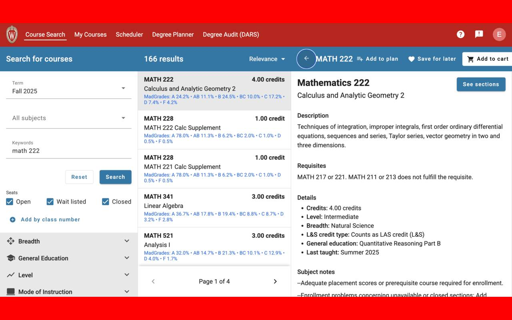
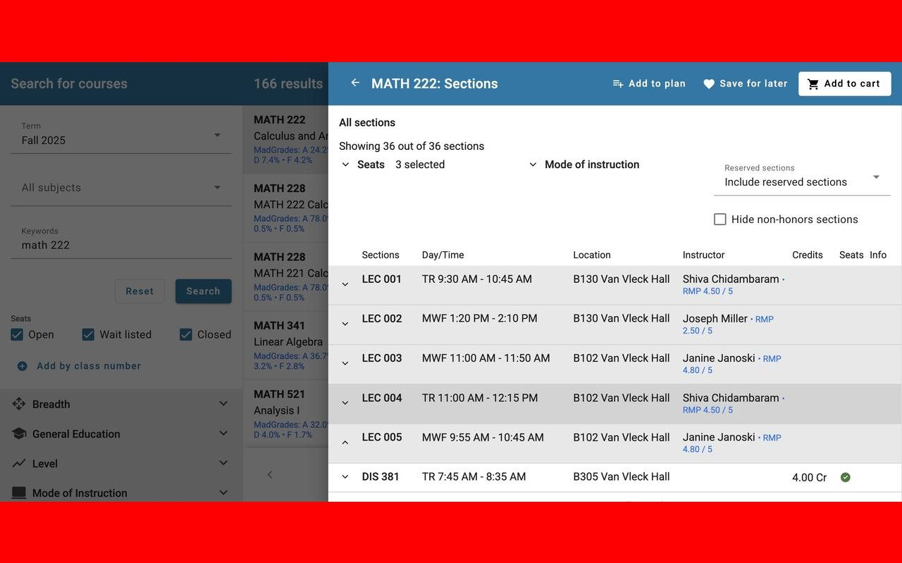

# Wisco Enroll Buddy Chrome Extension

**Wisco Enroll Buddy** enhances the University of Wisconsin-Madison Course Search & Enroll site (`enroll.wisc.edu`) by showing:

| What it adds | Where it appears | Click action |
|--------------|-----------------|--------------|
| **MadGrades grade percentages** (A, AB, B, … in one line) | Under each course title | Opens that course’s page on madgrades.com |
| **Rate-My-Professors average rating** (`RMP 4.37 / 5`) | After each instructor’s name | Opens that professor’s Rate-My-Professors page |

  
  

---

## Features

- 🔴 **MadGrades integration** – instantly shows historical grade splits.
- 🔵 **RMP integration** – displays professor averages out of 5.
- ⚡ Fast: each course / instructor is fetched once per tab and cached.
- ↗️ Links open in a new tab so your enrollment flow stays intact.

---

## Installation
Either download this extension off the chrome web store: <https://chromewebstore.google.com/detail/wisco-enroll-buddy/lmmibgleccnpbnoijbadkgbdbaegdgae>
1. **Download / Clone** this repo.  
2. Visit `chrome://extensions` (or **Edge/Brave** equivalents)  
   &nbsp;→ toggle **Developer mode** → **Load unpacked** → choose the folder.  
3. On first open the popup prompts for your **MadGrades API key**.

   - Sign in / sign up at <https://api.madgrades.com/>  
   - Click **Generate token** → copy the key → paste in the popup.

That’s it! Head to **<https://enroll.wisc.edu>**, search a course, and watch the labels appear.

---

## Usage notes & caveats

- **Missing data** – some professors aren’t listed on Rate-My-Professors and a few courses lack MadGrades records; in those cases you’ll see an incorrect rating or `RMP N/A / 5` or `MadGrades: no data`.  
- **Token safety** – your MadGrades key is stored with `chrome.storage.sync`; it never leaves your browser.

---

## Credits

- **[MadGrades](https://madgrades.com)** – grade data & public API.  
- **[RateMyProfessors](https://ratemyprofessors.com)** – professor ratings via their GraphQL endpoint.  
This extension merely surfaces their public information; all intellectual property belongs to the respective sites.

---
